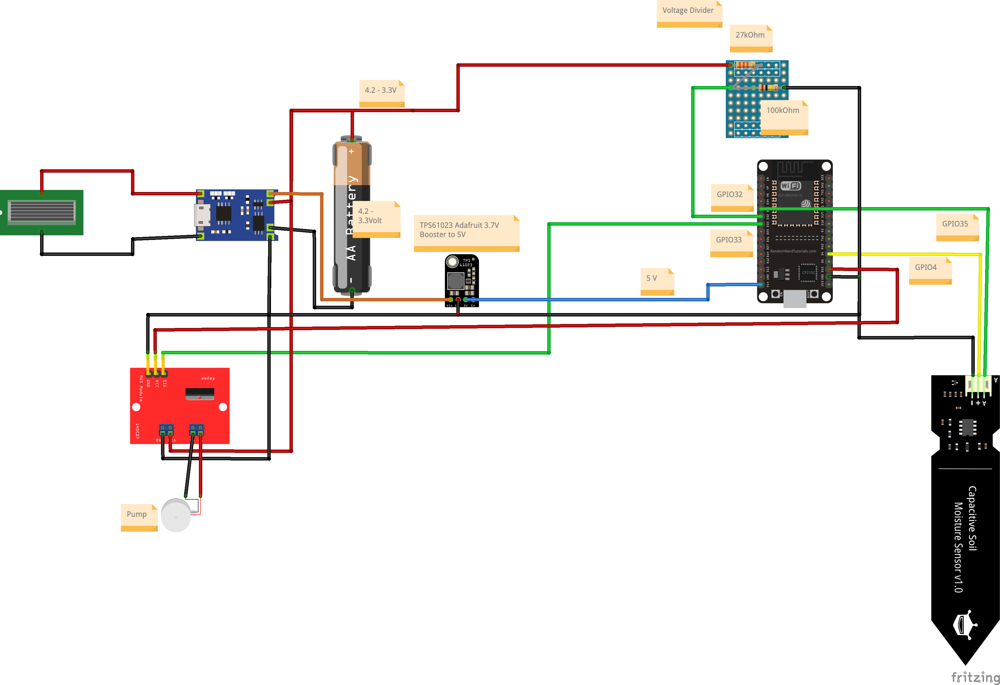

# Plantwatery

A project of Anna Dai and Maurin Widmer.

## Summary

Plantwatery is an automated watering system for your garden plants. It is based on an ESP32, a capacitive soil moisture sensor, solar cell & battery and a water pump. The system is autonomous and measures twice per day the soil moisture and operates the pump if needed. It's collected data and status is send via Wifi (MQTT protocol) to the cloud. All parts can easily be bought and the case is 3D printed (drawings are provided). The plastic housing is constructed to protect it's inner electronic parts from water and makes it easy to attach the solar panel, water pump and soil sensor.

The code is written with the Arduino framework and can easily be adapted to other platforms. 
It allows to change watering time & hours of the day, soil sensor offset and MQTT topics. Furthermore, the code automatically checks if a new version is online and updates itself if there is (for example because you want to change some parameters like soil sensor offset or watering time). 

## Changelog

### Version 9
Updated Version from 31.12.2022 includes:
* a LDO and capacitors in the electronics. Furthermore the standard ESP32 is used to further save battery power (no LED). Sketch is updated accordingly.
* Updated code with more reliable computing of how many seconds are needed until ESP32 needs to wake up to water the plants.

### Version 8
Inital Version

## Hardware

In the following you have a list of suggestions of parts you need to build this project. 

### Control unit:
* Microcontroller [ESP32 devkit](https://www.aliexpress.com/item/33048962331.html?spm=a2g0o.productlist.0.0.b58c2c098F7mfN&algo_pvid=9a81adc2-ce0c-47bb-a4dd-71a462476a64&algo_expid=9a81adc2-ce0c-47bb-a4dd-71a462476a64-10&btsid=0bb0623f16201391171217936ea511&ws_ab_test=searchweb0_0,searchweb201602_,searchweb201603_)
* Relay or Mosfet to control pump: [IRF520N Mosfet board](https://www.aliexpress.us/item/3256802178204101.html?spm=a2g0o.productlist.main.1.1a5f6302i3YTji&algo_pvid=0ce5794c-42fb-4e36-aaa8-a5433be1a823&algo_exp_id=0ce5794c-42fb-4e36-aaa8-a5433be1a823-0&pdp_ext_f=%7B%22sku_id%22%3A%2212000020329525170%22%7D&pdp_npi=2%40dis%21USD%210.56%210.48%21%21%21%21%21%40214527c616724085337403087d074b%2112000020329525170%21sea&curPageLogUid=xEbJenuVJ6Sc)
* Battery Management Board: [TP4056](https://www.aliexpress.com/item/4000522397541.html?spm=a2g0o.productlist.0.0.de4b58c9qydgt6&algo_pvid=69905307-5800-4be5-9b2b-80f6b985bcc4&algo_expid=69905307-5800-4be5-9b2b-80f6b985bcc4-0&btsid=0bb0623a16201391745902844e4ca4&ws_ab_test=searchweb0_0,searchweb201602_,searchweb201603_)
* Battery holder: [18650 Case](https://www.aliexpress.com/item/1005001707889794.html?spm=a2g0o.productlist.0.0.1e6d1e3dfwBJik&algo_pvid=513f1515-1784-40b9-8499-b16564c27130&algo_expid=513f1515-1784-40b9-8499-b16564c27130-0&btsid=0b0a557016201391231408758e1076&ws_ab_test=searchweb0_0,searchweb201602_,searchweb201603_)
* Battery: [18650 Lithium Rechargeable Battery 3.7V](https://www.aliexpress.com/item/32324914059.html?spm=a2g0o.productlist.0.0.27c22142u1oYY9&algo_pvid=61708288-d49a-48cc-b7a1-7b9bbae778fb&algo_expid=61708288-d49a-48cc-b7a1-7b9bbae778fb-1&btsid=0b0a555316201390081524110edf99&ws_ab_test=searchweb0_0,searchweb201602_,searchweb201603_)
* PCB Prototype board to solder the wires together and add the connectors: [PCB Prototype Board](https://www.aliexpress.com/item/32588853051.html?spm=a2g0o.productlist.0.0.690f190cdSvO5x&algo_pvid=8745a321-eece-4b08-916e-bb816e874ff8&algo_expid=8745a321-eece-4b08-916e-bb816e874ff8-0&btsid=0b0a555916201387423844532e53c2&ws_ab_test=searchweb0_0,searchweb201602_,searchweb201603_)
* Low voltage regulator: [LDO MCP1700-3302E](https://www.aliexpress.us/item/3256801422024433.html?spm=a2g0o.productlist.main.1.36911b92jKyL4d&algo_pvid=d1c0d471-dfcf-43ca-8115-c3d36c94d9e4&algo_exp_id=d1c0d471-dfcf-43ca-8115-c3d36c94d9e4-0&pdp_ext_f=%7B%22sku_id%22%3A%2212000016784495251%22%7D&pdp_npi=2%40dis%21USD%211.52%211.34%21%21%21%21%21%402100b18f16724500165956045d0780%2112000016784495251%21sea&curPageLogUid=KMySLVfZFq7C)
* Resistor: [27kOhm](https://www.aliexpress.us/item/2251832772049066.html?spm=a2g0o.productlist.main.1.71c77d8d4A7UNG&algo_pvid=6bcbae55-44a1-4079-8918-2374451c9662&algo_exp_id=6bcbae55-44a1-4079-8918-2374451c9662-0&pdp_ext_f=%7B%22sku_id%22%3A%2266355447606%22%7D&pdp_npi=2%40dis%21USD%210.59%210.5%21%21%21%21%21%402145288516724502803332305d073e%2166355447606%21sea&curPageLogUid=gIoRhM2fTH1P) and [100kOhm](https://www.aliexpress.us/item/2251832772049066.html?spm=a2g0o.productlist.main.1.71c77d8d4A7UNG&algo_pvid=6bcbae55-44a1-4079-8918-2374451c9662&algo_exp_id=6bcbae55-44a1-4079-8918-2374451c9662-0&pdp_ext_f=%7B%22sku_id%22%3A%2266355447606%22%7D&pdp_npi=2%40dis%21USD%210.59%210.5%21%21%21%21%21%402145288516724502803332305d073e%2166355447606%21sea&curPageLogUid=gIoRhM2fTH1P)
* Capacitor: [100uF](https://www.aliexpress.us/item/3256801889213205.html?spm=a2g0o.productlist.main.1.4b4a6bb7ffWzer&algo_pvid=dee6cb8c-09f9-4563-9b9a-3f3f717e9aa4&aem_p4p_detail=20221230173205893251182205860014403663&algo_exp_id=dee6cb8c-09f9-4563-9b9a-3f3f717e9aa4-0&pdp_ext_f=%7B%22sku_id%22%3A%2212000018654903102%22%7D&pdp_npi=2%40dis%21USD%211.27%211.13%21%21%21%21%21%402100bb6416724503250692932d075a%2112000018654903102%21sea&curPageLogUid=1WnkREr9rsM0&ad_pvid=20221230173205893251182205860014403663_1&ad_pvid=20221230173205893251182205860014403663_1) and [100nF](https://www.aliexpress.us/item/3256802138966377.html?spm=a2g0o.productlist.main.9.4b4a6bb7ffWzer&algo_pvid=dee6cb8c-09f9-4563-9b9a-3f3f717e9aa4&aem_p4p_detail=20221230173205893251182205860014403663&algo_exp_id=dee6cb8c-09f9-4563-9b9a-3f3f717e9aa4-4&pdp_ext_f=%7B%22sku_id%22%3A%2212000020096495156%22%7D&pdp_npi=2%40dis%21USD%210.91%210.91%21%21%21%21%21%402100bb6416724503250692932d075a%2112000020096495156%21sea&curPageLogUid=Zhi2z3cmokft&ad_pvid=20221230173205893251182205860014403663_5&ad_pvid=20221230173205893251182205860014403663_5)
* Cable connector: [PCB Screw Terminal](https://www.aliexpress.com/item/1000006518504.html?spm=a2g0o.productlist.0.0.753553808svNSN&algo_pvid=null&algo_expid=null&btsid=0b0a556216201400093754778e0179&ws_ab_test=searchweb0_0,searchweb201602_,searchweb201603_)
* Jumper cables: [Dupont Jumper Wire](https://www.aliexpress.com/item/32911287776.html?spm=a2g0o.detail.0.0.7f875552q3YbrB&gps-id=pcDetailBottomMoreThisSeller&scm=1007.13339.169870.0&scm_id=1007.13339.169870.0&scm-url=1007.13339.169870.0&pvid=9e77f922-b1ed-43af-a189-ed38dffac609&_t=gps-id:pcDetailBottomMoreThisSeller,scm-url:1007.13339.169870.0,pvid:9e77f922-b1ed-43af-a189-ed38dffac609,tpp_buckets:668%230%23131923%2362_668%230%23131923%2362_668%23888%233325%235_668%23888%233325%235_668%232846%238110%231995_668%235811%2327182%2353_668%232717%237560%23222_668%231000022185%231000066059%230_668%233468%2315608%23187_668%232846%238110%231995_668%235811%2327182%2353_668%232717%237560%23222_668%233164%239976%23952_668%233468%2315608%23187)
and some [longer cables](https://www.aliexpress.com/item/4000009001537.html?spm=a2g0o.productlist.0.0.5fd4257fB5iarJ&algo_pvid=1c5f1618-e462-4103-8249-88205578790c&algo_expid=1c5f1618-e462-4103-8249-88205578790c-0&btsid=0b0a555516201388513911642e8ba7&ws_ab_test=searchweb0_0,searchweb201602_,searchweb201603_)
* 3D printed housing

### Solar part:
* [Solar cell 5V, 200mA](https://www.aliexpress.com/item/32906698984.html?spm=a2g0o.productlist.0.0.7e174646s3atFa&algo_pvid=ffe7d644-ad29-4754-aad0-a4e805e1195d&algo_expid=ffe7d644-ad29-4754-aad0-a4e805e1195d-0&btsid=0b0a557216201399178301207e1874&ws_ab_test=searchweb0_0,searchweb201602_,searchweb201603_)
* 3D printed housing
* Some hot glue to make it waterproof
* Wooden stick to mount the housing

### Soil measuring part:

* Soil sensor: [Capacitive Soil Sensor](https://www.aliexpress.com/item/32832538686.html?spm=a2g0o.productlist.0.0.70be1298CuZCbd&algo_pvid=03a71152-fe64-495e-baa5-ce52589335b6&algo_expid=03a71152-fe64-495e-baa5-ce52589335b6-0&btsid=0b0a556c16201375263552257ec580&ws_ab_test=searchweb0_0,searchweb201602_,searchweb201603_)
* Some hot glue to make the electronics part waterproof

### Water part:

* Water pump, around 5V but they also work with 3.7V: [Mini Brushless Water Pump 5V, 2.4W](https://www.aliexpress.com/item/32995965702.html?spm=a2g0o.productlist.0.0.148213d7WiiVVc&algo_pvid=42949def-7ded-44ff-baf7-55eefb6475f7&algo_expid=42949def-7ded-44ff-baf7-55eefb6475f7-5&btsid=0b0a556a16201394058158545e4a43&ws_ab_test=searchweb0_0,searchweb201602_,searchweb201603_)
* Tubes, I got the 6mm (outside) as they fit perfectly inside of the pump fixture: [Tubes](https://www.aliexpress.com/item/4000859747207.html?spm=a2g0s.9042311.0.0.7d434c4d9Ae92m) 
* Connectors for the tubes (6mm): [Pipe connector](https://www.aliexpress.com/item/4001338085412.html?spm=a2g0o.detail.1000060.1.d8916b4bOSQm3U&gps-id=pcDetailBottomMoreThisSeller&scm=1007.13339.169870.0&scm_id=1007.13339.169870.0&scm-url=1007.13339.169870.0&pvid=5e90a557-ecfb-47ad-835c-de327359bc74&_t=gps-id:pcDetailBottomMoreThisSeller,scm-url:1007.13339.169870.0,pvid:5e90a557-ecfb-47ad-835c-de327359bc74,tpp_buckets:668%230%23131923%2357_668%230%23131923%2357_668%23888%233325%235_668%23888%233325%235_668%232846%238110%231995_668%235811%2327180%2341_668%232717%237562%23492_668%231000022185%231000066059%230_668%233468%2315607%2396_668%232846%238110%231995_668%235811%2327180%2341_668%232717%237562%23492_668%233164%239976%23386_668%233468%2315607%2396)
* Stopper for the end of the tubes: [Stopper connector](https://www.aliexpress.com/item/4000027416210.html?spm=a2g0o.detail.0.0.4a0d454eggQtPm&gps-id=pcDetailBottomMoreThisSeller&scm=1007.13339.169870.0&scm_id=1007.13339.169870.0&scm-url=1007.13339.169870.0&pvid=22fbe9bb-979b-482c-955a-72fbf8ae5a17&_t=gps-id:pcDetailBottomMoreThisSeller,scm-url:1007.13339.169870.0,pvid:22fbe9bb-979b-482c-955a-72fbf8ae5a17,tpp_buckets:668%230%23131923%2357_668%230%23131923%2357_668%23888%233325%235_668%23888%233325%235_668%232846%238110%231995_668%235811%2327180%2341_668%232717%237562%23492_668%231000022185%231000066059%230_668%233468%2315607%2396_668%232846%238110%231995_668%235811%2327180%2341_668%232717%237562%23492_668%233164%239976%23386_668%233468%2315607%2396)
* Large bucket
* Maybe some wooden sticks and some wire to hold the tubes in place

(Picture above showing Plantwatery version 8)

(Picture above showing Plantwatery version 9, see changelog)

## Electronics / Sketch

Here you can find a sketch of the wiring for the electronic components. It should be straight forward. I recommend to use some screw terminals to attach the longer wires of the external humidity sensor, pump and solar cell (compare image). Moreover, make sure to add the low voltage regulator as shown in the sketch. This makes sure that the esp32 works at 3.3V. Additionaly, the added capacitors help to smoothen out the supply voltage from potential voltage spikes. 

The drawings for the casing for all parts can be found in the folder: housing.

## Watering system

The tubes were connected to the pump and then placed between the plants. We used a Y connector to go to all plants and always have a small tube which has some self made small holes at the spots where it should water the plants. Therefore, we only have to change the tubes with the holes, if we rearrange the plants or want suddenly smaller holes.

## Code

To code is written for the Arduino framework with the PlatformIo IDE. Please make sure to add a file called: "config.h" to the src folder (copy and rename the config_example.h and fill in the details). If you do not have a OTA server you can just leave the URL like it is or remove everything with OTA from the code. 

Make sure to change the hum_threshold, hum_offset and the watering times according to your needs.

Have fun with the project and let us know if you have a question or if you build this. 

## ToDo 

### Further power improvement suggestion to investigate incase the kit uses too much power to recharge via solar cell
* Either switch the ESP32 devkit board with a board without the CP2102, regulator and power LED
* Scrap the power LED to get approx another 2mA power saving 
* Increase amount of solar cell and put them in series
* Add an Resistor to the TP4056 as shown in the video of [Andreas Spiess](https://www.youtube.com/watch?v=37kGva3NW8w)
* Try to use a different board lige TTGO T18 with many components integrated

